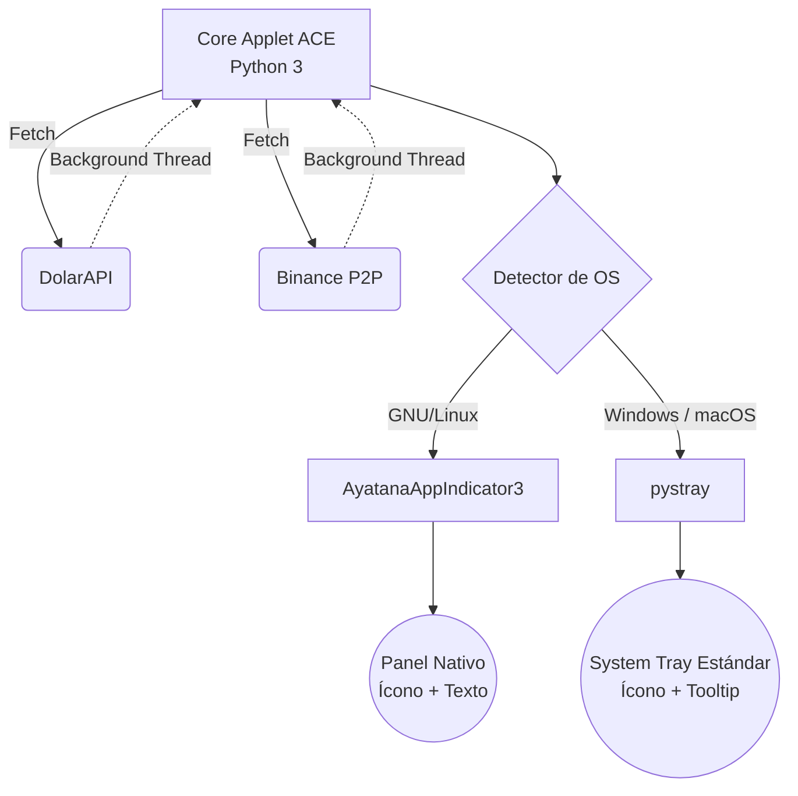

<div align="center">
  
  <h1>ACE (A Cuánto Está) - Widget de Tasas de Cambio</h1>
</div>


**🌍 Web App en Vivo:** [https://ace-panel.vercel.app](https://ace-panel.vercel.app)

**ACE** es un widget de bandeja del sistema (System Tray) ultra-ligero y profesional para monitorear el precio del dólar en Venezuela en tiempo real. 

Soporta múltiples fuentes de datos y funciona de manera nativa y transparente en **Windows, macOS y GNU/Linux**.

## 🚀 Características Principales

- **Multiplataforma Híbrida con Precio Siempre Visible**: 
  - En **GNU/Linux**, se integra con el panel nativo usando `AyatanaAppIndicator` mostrando el precio como texto junto al ícono en la barra superior.
  - En **Windows y macOS**, el precio se renderiza directamente **dentro del ícono** en la bandeja del sistema, visible permanentemente sin necesidad de hacer hover.
- **Múltiples Fuentes de Mercado**: 
  - Banco Central de Venezuela — Dólar BCV (`BCV $`).
  - Banco Central de Venezuela — Euro BCV (`BCV €`).
  - Promedio Paralelo (`Paralelo $`).
  - Binance P2P — Promedio en tiempo real de los mejores 10 comerciantes de venta USDT/VES.
- **Favorito Configurable**: Haz clic en cualquier fuente para fijarla como principal. La preferencia se guarda automáticamente.
- **Temporizadores Asíncronos Desacoplados**: 
  - BCV (Dólar + Euro) y Paralelo se actualizan cada 30 min.
  - Binance se actualiza cada 10 min (mercado altamente volátil).
- **Notificaciones de Escritorio**: Alertas nativas instantáneas si cualquier mercado sufre fluctuaciones.

## 🏗️ Arquitectura Híbrida

El núcleo de **ACE** está diseñado para garantizar que se sienta como una aplicación nativa sin importar el sistema operativo, resolviendo el problema histórico del renderizado de texto en la bandeja de GNU/Linux:



## ⚙️ Instalación

1. Clona el repositorio:
   ```bash
   git clone https://github.com/Serverket/ace.git
   cd ace
   ```

2. **Instalación Automática (Recomendada)**:
   - **Windows**: Haz clic derecho sobre `install_windows.ps1` y selecciona "Ejecutar con PowerShell". Esto instalará el widget, creará un acceso directo en tu escritorio y lo configurará para iniciar automáticamente con Windows.
   - **macOS**: Haz doble clic en `install_macos.command` (o ejecútalo en la terminal). Configurará el entorno y creará un *LaunchAgent* para que se ejecute de forma nativa en tu barra de menú al encender tu Mac.

3. **Instalación en GNU/Linux (AppImage)**:
   - Descarga el archivo `.AppImage` desde la sección de Releases.
   - Dale permisos de ejecución: `chmod +x ACE-v1.1.1-x86_64.AppImage`
   - Haz doble clic para ejecutarlo.
   - *Nota*: Para que el ícono aparezca correctamente en la barra superior (GNOME/Ubuntu), debes tener instalado el paquete de sistema: `sudo apt install gir1.2-ayatanaappindicator3-0.1`

4. **Instalación Manual desde código fuente**:
   ```bash
   python3 -m venv --system-site-packages venv
   source venv/bin/activate
   pip install -r requirements.txt
   python ace.py
   ```

## 📜 Acerca De & Atribución

**Autor**: [Serverket](https://serverket.dev)  
**Versión**: v1.1.0  
**Licencia**: [GNU General Public License v3.0 (GPLv3)](LICENSE).

### 🤝 Agradecimientos Especiales (Acknowledgements)

_"Whoever loves discipline loves knowledge, but whoever hates correction is stupid."_  
