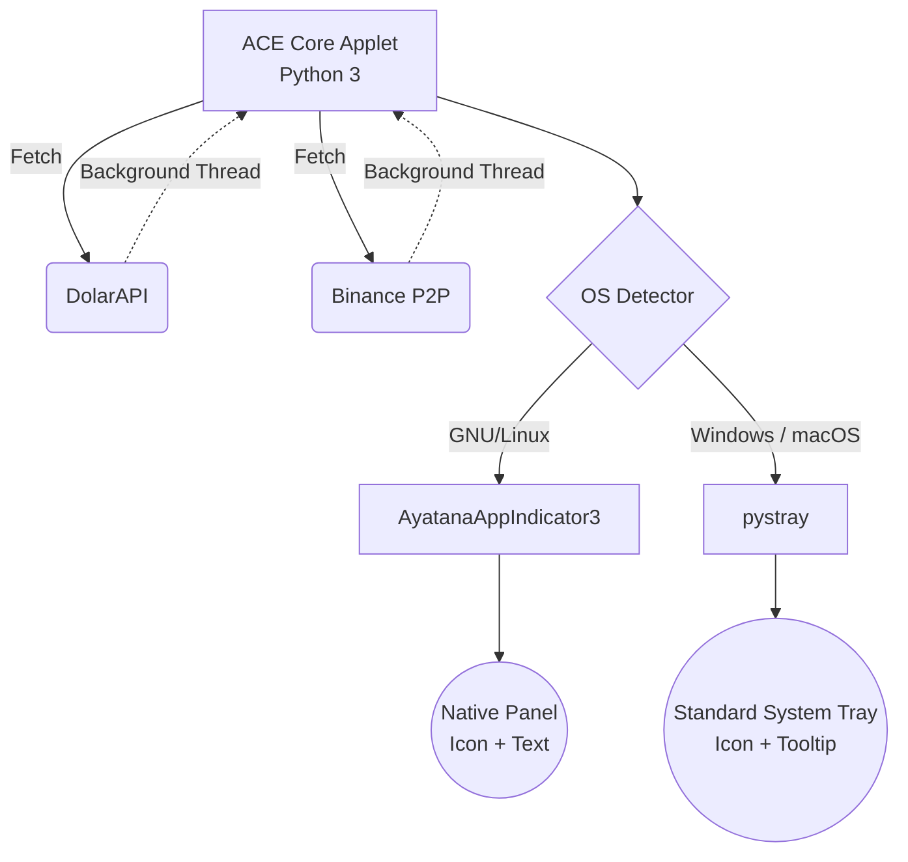

<div align="center">
  
  <h1>ACE (A Cuánto Está) - Real-time Exchange Rate Widget</h1>
</div>


**🌍 Live Web App:** [https://acecambio.pro](https://acecambio.pro)

**ACE** (A Cuánto Está) is an ultra-lightweight, professional system tray widget for real-time monitoring of Venezuelan exchange rates.

It supports multiple data sources and runs natively and seamlessly on **Windows, macOS, and GNU/Linux**.

*[Lee esta documentación en Español](README.es.md)*

## 🚀 Key Features

- **Hybrid Multi-Platform with Always-Visible Price**: 
  - On **GNU/Linux**, it integrates with the native panel using `AyatanaAppIndicator`, displaying the price as text right next to the tray icon in the top bar.
  - On **Windows and macOS**, the price is rendered as pixels **directly inside the tray icon**, making it permanently visible without needing to hover over it.
- **Multiple Market Sources**: 
  - Central Bank of Venezuela — Official USD (`BCV $`).
  - Central Bank of Venezuela — Official EUR (`BCV €`).
  - Parallel Market Average (`Paralelo $`).
  - Binance P2P — Real-time average of the top 10 USDT/VES sell merchants.
- **Configurable Favorite**: Click any source to set it as your primary pinned rate. The preference is automatically saved.
- **Decoupled Asynchronous Timers**: 
  - BCV (USD + EUR) and Parallel rates update every 30 minutes.
  - Binance updates every 10 minutes (highly volatile market).
- **Desktop Notifications**: Instant native alerts if any market experiences fluctuations.

## 🏗️ Hybrid Architecture

The core of **ACE** is designed to ensure it feels like a native application regardless of the OS, solving the historical text rendering limitations of system trays:



## ⚙️ Installation

1. Clone the repository:
   ```bash
   git clone https://github.com/Serverket/ace.git
   cd ace
   ```

2. **Automated Installation (Recommended)**:
   - **Windows**: Right-click `install_windows.ps1` and select "Run with PowerShell". This will install the widget, create a desktop shortcut, and configure it to run on startup.
   - **macOS**: Double-click `install_macos.command` (or run it in the terminal). It will set up the environment and create a *LaunchAgent* to run it natively in your menu bar on boot.

3. **GNU/Linux Installation (AppImage)**:
   - Download the `.AppImage` file from the Releases section.
   - Grant execution permissions: `chmod +x ACE-v1.1.1-x86_64.AppImage`
   - Double-click to run it.
   - *Note*: For the icon to render correctly in the top bar (GNOME/Ubuntu), you must have the following system package installed: `sudo apt install gir1.2-ayatanaappindicator3-0.1`

4. **Manual Installation from source**:
   ```bash
   python3 -m venv --system-site-packages venv
   source venv/bin/activate
   pip install -r requirements.txt
   python ace.py
   ```

## 📜 About & Attribution

**Author**: [Serverket](https://serverket.dev)  
**Version**: v1.1.1  
**License**: [GNU General Public License v3.0 (GPLv3)](LICENSE).

### 🤝 Special Acknowledgements

_"Whoever loves discipline loves knowledge, but whoever hates correction is stupid."_  
